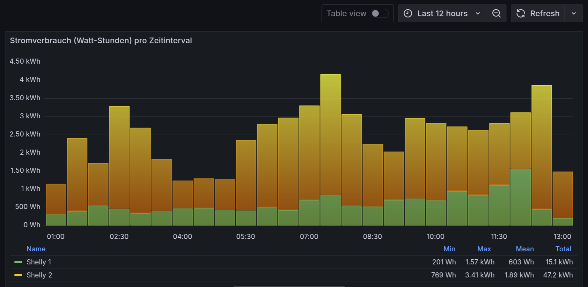
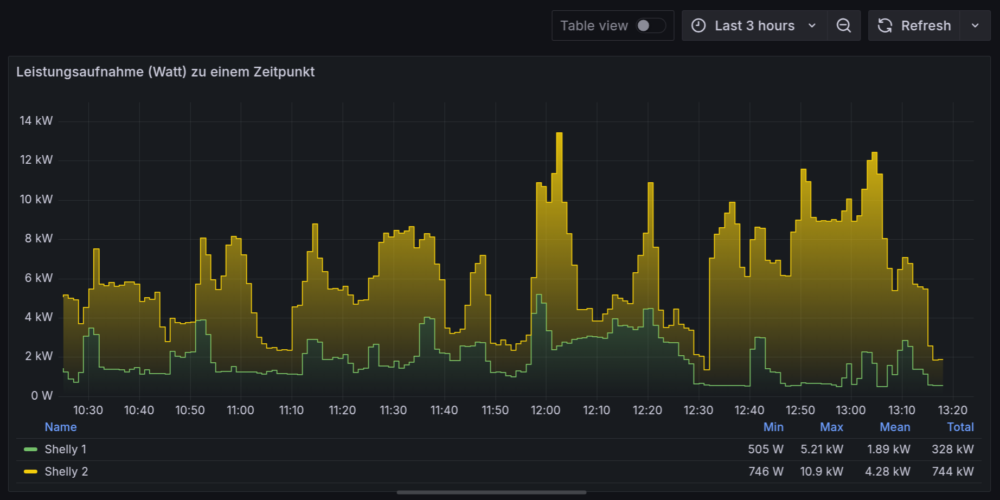
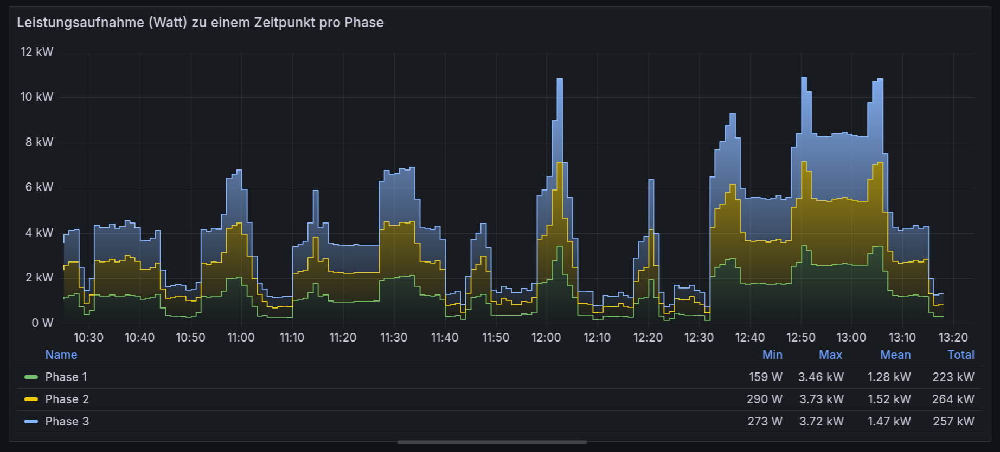

# Grafana Dashboard

Here are some example Influx queries for the dashboard.


### Energy consumption by time



* Stacked bar chart
* On query per device
  ```influxql
  SELECT sum("total_act_energy")
  FROM "shelly_em" 
  WHERE ("device_name"::tag = 'my_shelly_divename') 
    AND $timeFilter 
  GROUP BY time($__interval) fill(null)
  ```

### Power consumption by device



* Stacked line chart
* One query per device
  ```influxql
  SELECT mean("total_act_energy") * 60 as  total_act_power
  FROM "shelly_em" 
  WHERE ("device_name"::tag = 'my_shelly_divename') AND $timeFilter 
  GROUP BY time($__interval) fill(null)
  ```

### Power consumption by phase



* Stacked line chart
* One query per phase
  ```influxql
  SELECT mean("a_total_act_energy") * 60 as  a_total_act_power
  FROM "shelly_em" 
  WHERE ("device_name"::tag = 'Shelly-Pro3EM-Kuhstall') AND $timeFilter 
  GROUP BY time($__interval) fill(null)
  ```

### Energy consumption by month for a given year

* Flux query
  ```flux
  import "experimental"
  import "strings"
  import "date"

  startTime = time(v: "2025-01-01T00:00:00Z")
  stopTime = experimental.addDuration(d: 1y, to: startTime)

  from(bucket: "shelly_em")
    |> range(start: startTime, stop: stopTime)
    |> filter(fn: (r) =>
        r._measurement == "shelly_em"
        and r._field == "total_act_energy" 
        and r.device_name == "my_shelly_divename"
    )
    |> aggregateWindow(every: 1mo, fn: sum)
    |> map(fn: (r) => ({
        _time: time(v: uint(v: r._time) - uint(v: 1000000000)),
        total_act_energy: r._value
    }))
  ```    

